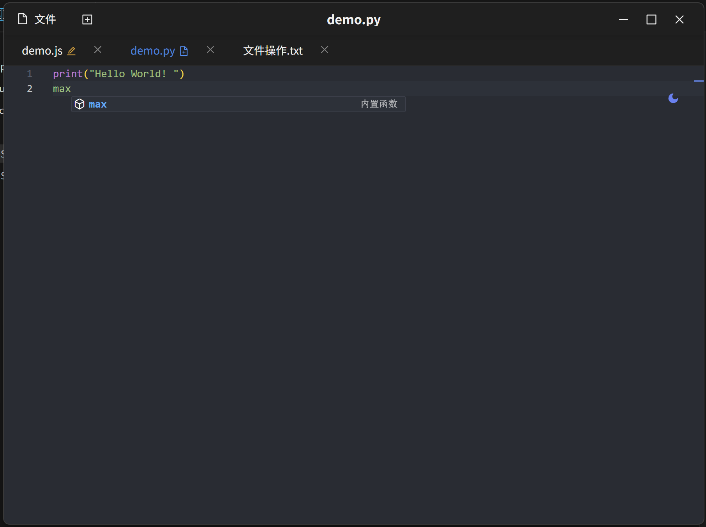
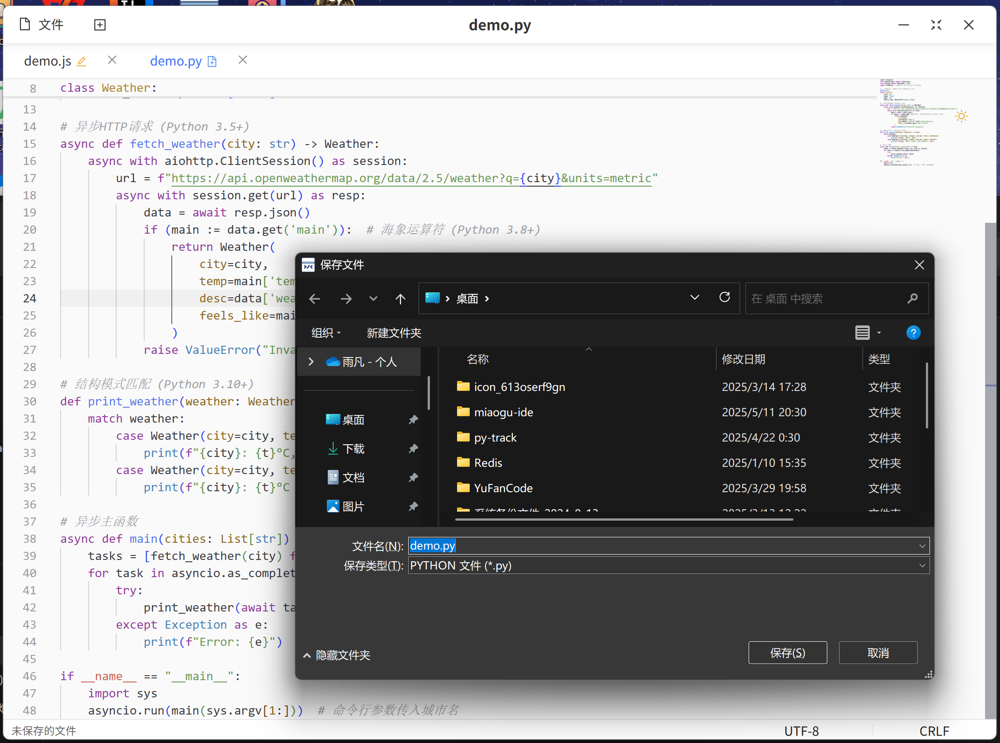
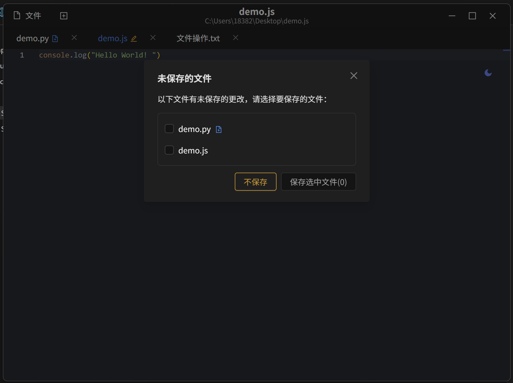
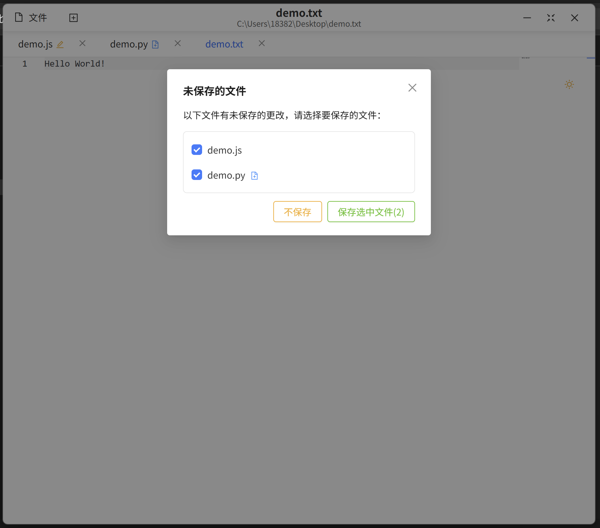

# 喵咕IDE

   

**喵咕IDE** 是一款专为开发者设计的、集成Monaco代码编辑器框架以及现代前端技术与桌面应用的优势，旨在提供一个高效、智能且用户友好的编码体验。

## 🚀 核心特性

- **代码补全与建议**：基于Monaco框架编辑器上下文的智能代码提示，加速开发流程。
- **多语言支持**：支持主流编程语言的语法高亮、补全建议和语法检查#目前仅支持JSon、JS/TS、HTML、CSS以及相关框架。
- **主题定制**：支持明暗主题切换，满足个性化偏好。

## 📸 页面截图展示

### IDE主界面

| 代码编辑区                           | 新建文件                                |
| ------------------------------------ | --------------------------------------- |
|  |  |

### 未保存文件

| 无选中                                   | 选中                                |
| ---------------------------------------- | ----------------------------------- |
|  |  |

## 🛠 技术架构

| 层级               | 技术组件                                           |
| ------------------ | -------------------------------------------------- |
| **桌面层**   | Electron + Node.js                                 |
| **渲染层**   | React + Ant Design + Monaco Editor                 |
| **AI服务层** | (可根据实际AI服务填写，如 OpenAI API, Local LLM等) |
| **通信层**   | IPC Main/Renderer                                  |
| **构建工具** | Vite + electron-vite / electron-builder            |

## 📂 项目结构

```
miaogu-ide/
├── .idea/                # IDE配置文件（WebStorm/IntelliJ）
├── .vscode/              # VSCode配置文件
├── build/                # 构建输出目录
│   └── icons/            # 应用图标资源
├── commits/              # 版本提交记录
├── docs/                 # 项目文档
├── imgs/                 # 应用截图
│   └── miaogu_ide_*.png  # 界面截图
├── resources/            # 应用资源
│   ├── icon.png          # 应用图标
│   └── python-logo.svg   # Python语言图标
├── scripts/              # 脚本文件
└── src/                  # 核心代码
    ├── main/             # Electron主进程（Node.js）
    │   ├── index.js      # 主进程入口
    │   └── store.js      # 主进程数据存储
    ├── preload/          # 预加载脚本
    │   ├── index.js      # 预加载入口
    │   └── ipc_bridge.js # IPC通信桥接
    └── renderer/         # React应用（Web技术）
        ├── public/       # 静态公共资源
        └── src/          # 渲染进程源码
            ├── api/      # API接口配置
            │   ├── config.js    # API配置
            │   ├── index.js     # API导出
            │   └── ipc_config.js # IPC通信配置
            ├── assets/   # 样式资源
            │   ├── base.scss    # 基础样式
            │   └── main.scss    # 主样式
            ├── components/ # React组件
            │   ├── AppHeader.jsx      # 应用头部
            │   ├── EditorStatusBar.jsx # 编辑器状态栏
            │   ├── EditorWithFileContext.jsx # 文件上下文编辑器
            │   └── TabBar.jsx         # 标签栏
            ├── configs/   # 配置文件
            │   └── file-blacklist.js  # 文件黑名单
            ├── contexts/  # React上下文
            │   ├── FileContext.jsx    # 文件上下文
            │   └── file-extensions.json # 文件扩展名配置
            ├── plugins/   # 插件
            │   └── toast.js # 提示插件
            └── utils/     # 工具函数
                └── unicode.js # Unicode处理
```

## 🛠️ 开发准备

### 环境要求

- Node.js ≥18.0
- (其他依赖，如Python环境，如果AI服务需要)

### 启动开发环境

```bash
# 安装依赖
npm install

# 启动Electron开发模式
npm run dev

# 构建打包 (示例)
npm run build:win
npm run build:linux
npm run build:mac
```

## 🤝 贡献指南

欢迎通过GitHub提交PR：

1. Fork 本仓库
2. 创建特性分支 (`git checkout -b feature/你的特性名称`)
3. 提交你的代码 (`git commit -m 'feat: 添加了某某特性'`)
4. 推送到远端分支 (`git push origin feature/你的特性名称`)
5. 创建 Pull Request

## 📜 开源协议

[MIT License](LICENSE)

---

**喵咕IDE - 赋能开发者，智创未来** 🚀 欢迎提出Issue ✨
