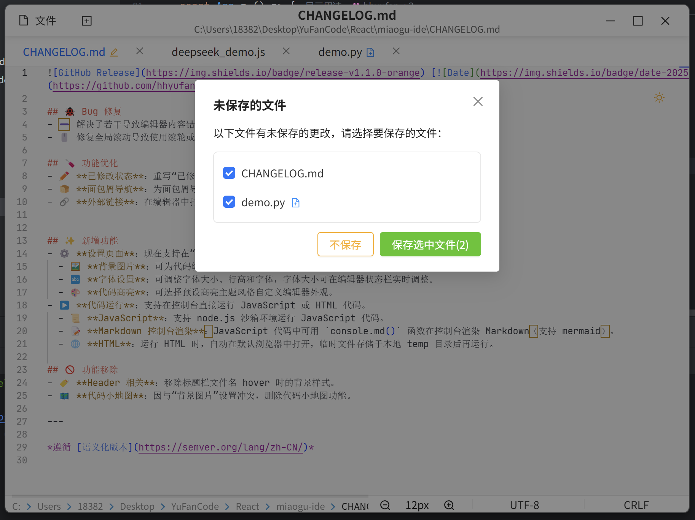
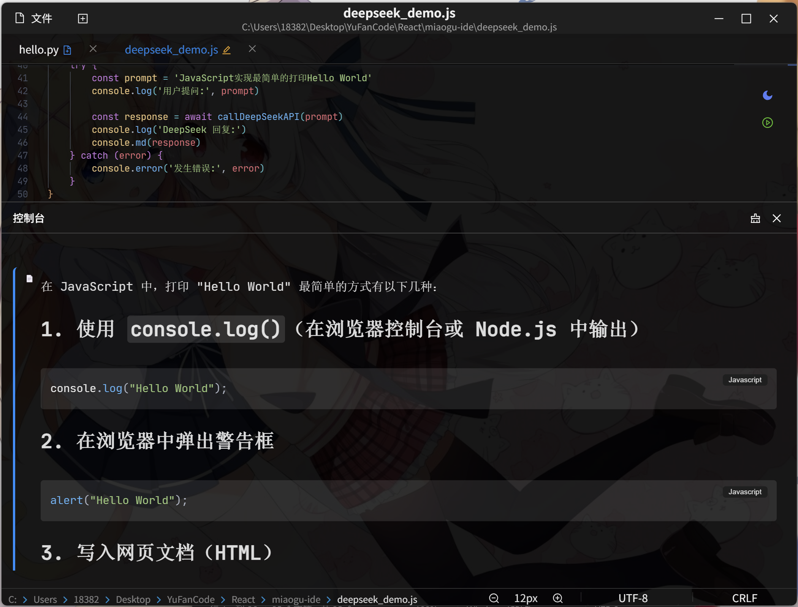
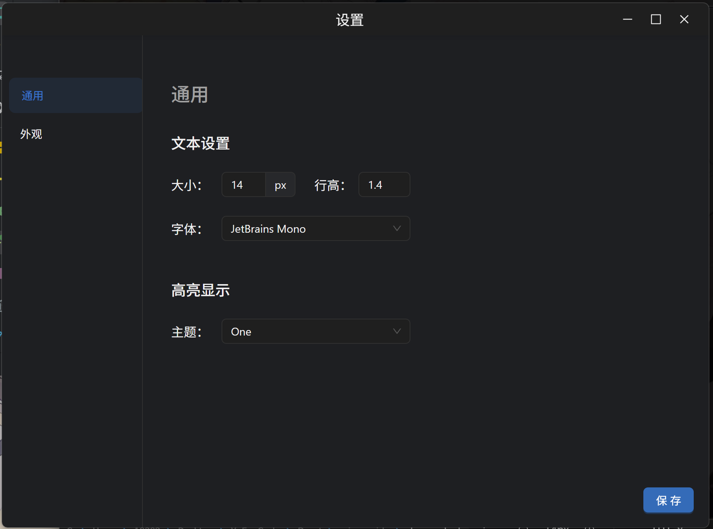
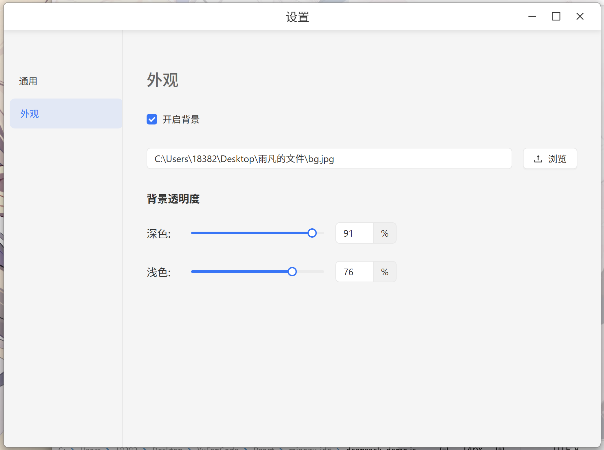

# 喵咕IDE

   

**喵咕IDE** 是一款专为开发者设计的、集成Monaco代码编辑器框架以及现代前端技术与桌面应用的优势，旨在提供一个高效、智能且用户友好的编码体验。

## 🚀 核心特性

- **代码补全与建议**：基于Monaco框架编辑器上下文的智能代码提示，加速开发流程。
- **多语言支持**：支持主流编程语言的语法高亮、补全建议和语法检查#目前仅支持JSon、JS/TS、HTML、CSS以及相关框架。
- **代码运行**：支持JavaScript和HTML的控制台运行以及支持markdown渲染。
- **主题定制**：支持明暗主题切换，适配不同用户需求。
- **编辑器设置**：支持设置字体，高亮主题，背景图片，满足个性化偏好。
## 📸 页面截图展示

### IDE主界面

| 代码编辑区                           | 未保存状态                               |
| ------------------------------------ |-------------------------------------|
|  |  |

### 背景图片

| 深色模式                            | 浅色模式                             |
|---------------------------------|----------------------------------|
|  |  |

### 设置页面
| 通用                                | 外观                                  |
|-----------------------------------|-------------------------------------|
|  |  |
## 🛠 技术架构

| 层级               | 技术组件                                           |
| ------------------ | -------------------------------------------------- |
| **桌面层**   | Electron + Node.js                                 |
| **渲染层**   | React + Ant Design + Monaco Editor                 |
| **AI服务层** | (可根据实际AI服务填写，如 OpenAI API, Local LLM等) |
| **通信层**   | IPC Main/Renderer                                  |
| **构建工具** | Vite + electron-vite / electron-builder            |

## 📂 项目结构

```
miaogu-ide/
├── .idea/                # IDE配置文件（WebStorm/IntelliJ）
├── .vscode/              # VSCode配置文件
├── build/                # 构建输出目录
├── commits/              # 版本提交记录
├── docs/                 # 项目文档
├── imgs/                 # 应用截图
├── resources/            # 应用资源
├── scripts/              # 脚本文件
└── src/                  # 核心代码
    ├── main/             # Electron主进程（Node.js）
    ├── preload/          # 预加载脚本
    └── renderer/         # React应用（Web技术）
        ├── public/       # 静态公共资源
        └── src/          # 渲染进程源码
            ├── api/      # API接口配置
            ├── assets/   # 样式资源
            ├── components/ # React组件
               └── setting/       # 设置相关组件
            ├── configs/   # 配置文件
            ├── hooks/     # hook函数
            ├── plugins/   # 插件
            └── utils/     # 工具函数
```

## 🛠️ 开发准备

### 环境要求

- Node.js ≥18.0
- (其他依赖，如Python环境，如果AI服务需要)

### 启动开发环境

```bash
# 安装依赖
npm install

# 启动Electron开发模式
npm run dev

# 构建打包 (示例)
npm run build:win
npm run build:linux
npm run build:mac
```

## 🤝 贡献指南

欢迎通过GitHub提交PR：

1. Fork 本仓库
2. 创建特性分支 (`git checkout -b feature/你的特性名称`)
3. 提交你的代码 (`git commit -m 'feat: 添加了某某特性'`)
4. 推送到远端分支 (`git push origin feature/你的特性名称`)
5. 创建 Pull Request

## 📜 开源协议

[MIT License](LICENSE)

---

**喵咕IDE** 🚀 欢迎提出Issue ✨
