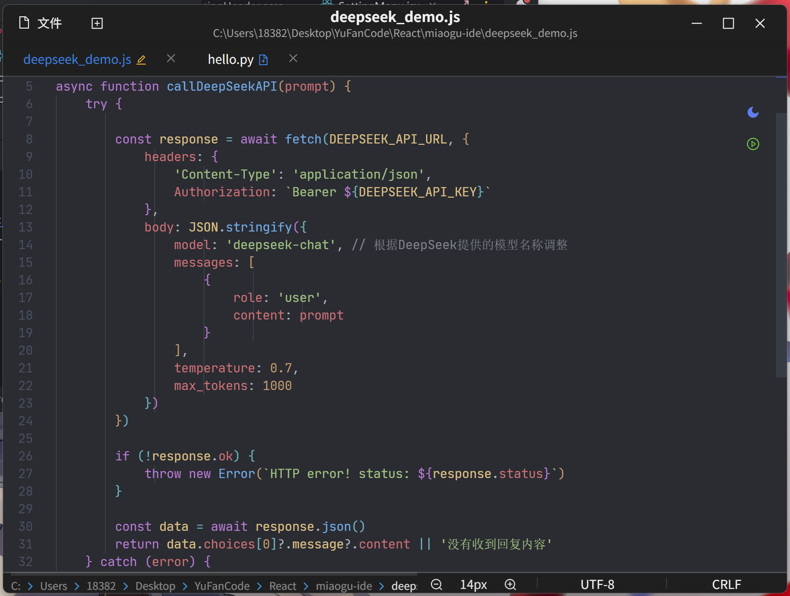

# 喵咕IDE

   

**喵咕IDE** 是一款专为开发者设计的、集成Monaco代码编辑器框架以及现代前端技术与桌面应用的优势，旨在提供一个高效、智能且用户友好的编码体验。

## 🚀 核心特性

- **代码补全与建议**：基于Monaco框架编辑器上下文的智能代码提示，加速开发流程。
- **多语言支持**：支持主流编程语言的语法高亮、补全建议和语法检查#目前仅支持JSon、JS/TS、HTML、CSS以及相关框架。
- **主题定制**：支持明暗主题切换，满足个性化偏好。

## 📸 页面截图展示

### IDE主界面

| 代码编辑区                           | 新建文件                                |
| ------------------------------------ | --------------------------------------- |
|  |  |

### 未保存文件

| 无选中                                   | 选中                                |
| ---------------------------------------- | ----------------------------------- |
|  |  |

## 🛠 技术架构

| 层级               | 技术组件                                           |
| ------------------ | -------------------------------------------------- |
| **桌面层**   | Electron + Node.js                                 |
| **渲染层**   | React + Ant Design + Monaco Editor    |
| **AI服务层** | (可根据实际AI服务填写，如 OpenAI API, Local LLM等) |
| **通信层**   | IPC Main/Renderer                                  |
| **构建工具** | Vite + electron-vite / electron-builder            |

## 📂 项目结构

```
miaogu-ide/
├── src/                  # 核心代码
│   ├── main/             # Electron主进程（Node.js）
│   ├── preload/          # 预加载脚本
│   │   └── index.ts      # IPC通信桥接等
│   └── renderer/         # React应用（Web技术）
│       ├── api/          # API接口封装
│       ├── assets/       # 静态资源
│       ├── components/   # UI组件
│       ├── features/     # 功能模块 (如 AI助手, 编辑器, 终端等)
│       ├── hooks/        # 自定义Hooks
│       ├── layouts/      # 布局组件
│       ├── pages/        # 页面组件
│       ├── services/     # 应用服务 (如状态管理, AI交互逻辑)
│       ├── styles/       # 全局样式
│       ├── types/        # TypeScript类型定义
│       └── utils/        # 工具函数
│
├── resources/            # 应用资源 (如图标)
│
└── imgs/                 # 应用截图
    └── miaogu_ide_*.png  # 界面截图
```

## 🛠️ 开发准备

### 环境要求

- Node.js ≥18.0
- (其他依赖，如Python环境，如果AI服务需要)

### 启动开发环境

```bash
# 安装依赖
npm install

# 启动Electron开发模式
npm run dev

# 构建打包 (示例)
npm run build:win
npm run build:linux
npm run build:mac
```

## 🤝 贡献指南

欢迎通过GitHub提交PR：

1. Fork 本仓库
2. 创建特性分支 (`git checkout -b feature/你的特性名称`)
3. 提交你的代码 (`git commit -m 'feat: 添加了某某特性'`)
4. 推送到远端分支 (`git push origin feature/你的特性名称`)
5. 创建 Pull Request

## 📜 开源协议

[MIT License](LICENSE)

---

**喵咕IDE - 赋能开发者，智创未来** 🚀 欢迎提出Issue ✨
